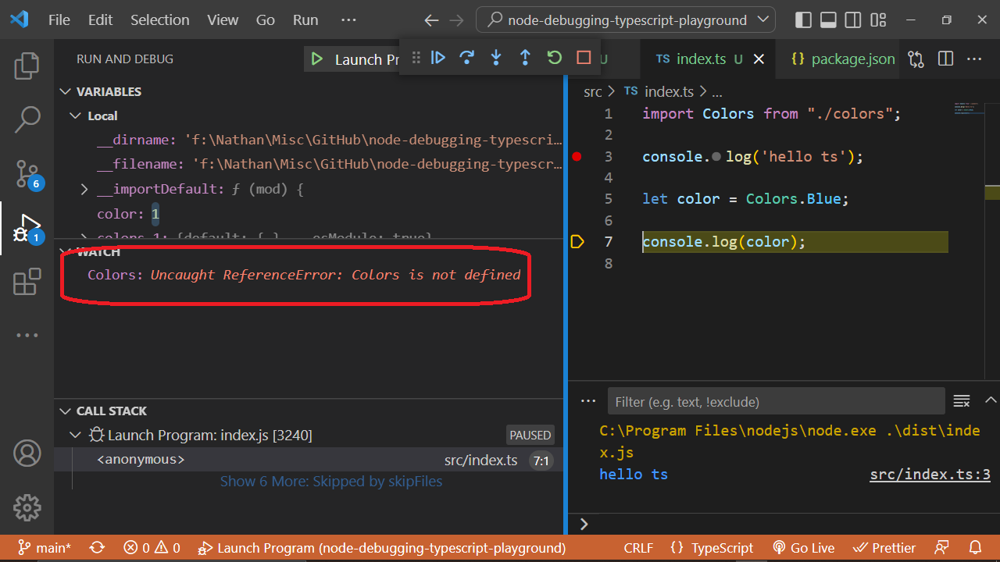

<h2>Motivation</h2>
It is possible to debug node typescript application using F5 and launch.json but not every thing is shown. For example you can not watch Colors which is an enum. Check e.g. here

<h2>Current status</h2>
I do not have solution for this

